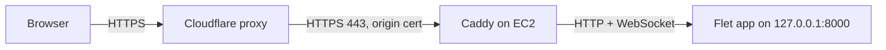

# Atlas on EC2: Deployment Guide

Last updated Sep 26, 2026

## Overview

Atlas runs as one Python process on a t4g.small in Singapore, reachable only through Cloudflare and Caddy at https://atlasofseeds.com. Terraform in [`infra/`](infra/) creates the server, the network rules and the Cloudflare setup; the app is copied over with `rsync`. The code needs no changes: on a headless Linux server Flet serves `world.py` as a web app on its own.



| Piece | What it does | Why it's there |
| --- | --- | --- |
| Cloudflare | DNS, public HTTPS certificate, proxy | Hides the server's IP, caches Flet's static files, absorbs junk traffic |
| Caddy | Takes HTTPS on port 443, passes requests and WebSockets to Flet; redirects `www` to the apex | Terminates TLS with the Cloudflare origin certificate; no config needed for WebSockets |
| Flet (`world.py`) | Serves the page and a WebSocket at `/ws`; draws every frame on the server | The app itself; listens only on `127.0.0.1`, so nothing can skip Caddy |
| systemd | Starts Atlas on boot, restarts it if it crashes | Keeps the app up without a terminal open |
| Terraform | Creates and updates everything above except the app code | One command rebuilds the setup; nothing is clicked together by hand |

All visitors share the one process, and each visitor's session lives in its memory. Don't run several workers, and expect a restart to drop everyone connected.

The server is in Singapore (`ap-southeast-1`) because every drag on the globe makes a round trip to it: about 30 ms from Vietnam, against about 230 ms to the US east coast. To serve somewhere else, set `aws_region` in `infra/terraform.tfvars` before the first apply.

## Before you start

You need the AWS CLI signed in to your account, Terraform 1.14 or newer, and `ssh` and `rsync` on your Mac. Expect about $21 a month plus the domain, before bandwidth.

| Item | Cost in ap-southeast-1 | Notes |
| --- | --- | --- |
| t4g.small instance | ~$15.50 / month | $0.0212 / hour on demand |
| 20 GB gp3 disk | ~$1.90 / month | $0.096 per GB-month |
| Public IPv4 (Elastic IP) | ~$3.65 / month | $0.005 / hour, charged whether or not it's attached |
| Domain (atlasofseeds.com) | $10.46 / year | Cloudflare Registrar, at cost |
| Outbound data | $0.12 / GB after the first 100 GB a month | A moving globe sends ~0.5 MB/s per visitor, about 1.8 GB an hour |
| CPU surplus (unlimited mode) | $0.04 per vCPU-hour above baseline | Only when visitors keep the globe moving for long stretches |

Prices are from the AWS Price List API on Sep 26, 2026.

## Step 1: The domain

**Done.** `atlasofseeds.com` is registered on Cloudflare Registrar, so its DNS is already on Cloudflare.

| | |
| --- | --- |
| Expires | Sep 26, 2027 |
| Auto-renew | Off; renew by hand for $10.46, or turn it on under **Domains → Registrations** |
| WHOIS privacy | On (redaction) |

The registry emails the registrant address to verify it. Click that link within 15 days of registering, or the domain is suspended.

## Step 2: Prepare credentials

Terraform needs three things from you: an SSH key for the server, a Cloudflare API token, and AWS credentials.

**SSH key.** Create one for the server; Terraform installs the public half:

```bash
ssh-keygen -t ed25519 -f ~/.ssh/atlas -C atlas
```

**Cloudflare API token.** Terraform talks to Cloudflare's API to create the DNS records, change the SSL settings and issue the origin certificate, so it needs its own token. In the Cloudflare dashboard, open **My Profile → API Tokens → Create Token → Create Custom Token**, add these permissions, and set **Zone Resources** to *Include → Specific zone → atlasofseeds.com*:

| Permission | Access | Used for |
| --- | --- | --- |
| Zone → Zone | Read | Looking up the zone |
| Zone → DNS | Edit | The A record for the apex, the CNAME for `www` |
| Zone → Zone Settings | Edit | Full (strict), Always Use HTTPS, minimum TLS 1.2, WebSockets |
| Zone → SSL and Certificates | Edit | The origin certificate Caddy uses |

Copy the token, then save it to a private file outside the repo by typing (not pasting, which would replace the token on your clipboard) this command:

```bash
mkdir -p ~/.config/atlas && pbpaste > ~/.config/atlas/cloudflare-token && chmod 600 ~/.config/atlas/cloudflare-token
```

Check it without printing it; this should say `"status":"active"`:

```bash
curl -s -H "Authorization: Bearer $(tr -d '[:space:]' < ~/.config/atlas/cloudflare-token)" \
  https://api.cloudflare.com/client/v4/user/tokens/verify
```

**AWS credentials.** Terraform uses the same credentials as the AWS CLI. Check them with `aws sts get-caller-identity`. If Terraform later says it can't find credentials (the CLI's `aws login` sessions need newer SDKs), load them into the shell first:

```bash
eval "$(aws configure export-credentials --format env)"
```

**Variables.** `infra/terraform.tfvars` (git-ignored) holds the two values without defaults. Copy `infra/terraform.tfvars.example` if it's missing:

```hcl
budget_alert_email = "you@example.com"
ssh_ingress_cidr   = "203.0.113.7/32"   # your IP: curl -s https://checkip.amazonaws.com
```

## Step 3: Create the infrastructure

From the `infra/` folder:

```bash
cd infra
export CLOUDFLARE_API_TOKEN=$(tr -d '[:space:]' < ~/.config/atlas/cloudflare-token)
terraform init
terraform plan      # read it: about 30 resources, nothing destroyed
terraform apply
```

This creates:

| Where | What |
| --- | --- |
| AWS | A t4g.small running Ubuntu 24.04 (Arm) with a 20 GiB encrypted gp3 disk; an Elastic IP; the `atlas` key pair |
| AWS | Security group `atlas-sg`: SSH from `ssh_ingress_cidr` only, HTTPS from Cloudflare's IPv4 ranges only, port 80 closed |
| AWS | A $30 monthly budget that emails at 80% of actual spend and when the forecast passes 100% |
| Cloudflare | Proxied DNS: an A record for `atlasofseeds.com`, a CNAME for `www` |
| Cloudflare | SSL mode Full (strict), Always Use HTTPS, minimum TLS 1.2, WebSockets on |
| Cloudflare | A 15-year origin certificate for `atlasofseeds.com` and `*.atlasofseeds.com` |

On its first boot the server sets itself up (see `infra/cloud-init.yaml.tftpl`): 1 GB of swap, security updates, Caddy with the origin certificate, uv, and the `atlas` systemd unit. This takes 3 to 5 minutes. Wait for it:

```bash
$(terraform output -raw ssh_command) cloud-init status --wait   # ends with "status: done"
```

Until the app is deployed in the next step, the site shows a Caddy 502 error. That's expected.

AWS emails `budget_alert_email` once to confirm the budget alerts; confirm it.

## Step 4: Deploy the app

Copy the project to `~/atlas` on the server, install its locked dependencies with uv, and start the service. The `deploy.sh` script in "Shipping updates" does exactly this; run it once now, from the project folder:

```bash
cd ..
bash deploy.sh
```

It should end with `active`. `--locked` installs exactly what `uv.lock` pins, and `--no-dev` skips `flet-mcp`. numpy and Pillow have Arm wheels, so nothing compiles.

The rsync in the script excludes `infra/`: the Terraform state in there holds the origin certificate's private key, and it has no business on the server.

## Step 5: Verify the deployment

The deployment is done when the site loads through Cloudflare, the server can't be reached directly, and an idle tab still responds after five minutes.

**From your Mac:**

```bash
EIP=$(terraform -chdir=infra output -raw public_ip)
curl -sI https://atlasofseeds.com/ | head -3        # HTTP/2 200, and a "server: cloudflare" header
curl -sI https://www.atlasofseeds.com/ | head -3    # HTTP/2 301 to https://atlasofseeds.com/
curl -m 5 -kI https://$EIP/                         # should time out: direct access is blocked
curl -m 5 -I http://$EIP:8000/                      # should time out too
```

**In a browser:**

- [ ] `https://atlasofseeds.com` shows Atlas with world 282
- [ ] Typing a new seed builds a new world
- [ ] The globe view turns when dragged and comes to rest about 30 seconds after you let go
- [ ] A replay plays with sound (click on the page first: browsers block audio until the page gets a click or key press)
- [ ] On a phone, the side panel sits under the map and the page scrolls
- [ ] **Idle tab test:** leave a tab on the resting globe for 5 minutes, then drag it. If it doesn't respond or shows a reconnect, Cloudflare closed the idle WebSocket, and the app needs a small keepalive
- [ ] **Reboot test:** `sudo reboot` on the server; the site comes back within a minute or two. This also loads any kernel update from the first boot

## Shipping updates

An update is an `rsync`, a `uv sync`, and a restart. The restart disconnects everyone viewing the site, because sessions live in the process's memory.

Save this as `deploy.sh` in the project folder:

```bash
#!/usr/bin/env bash
set -euo pipefail
cd "$(dirname "$0")"
HOST=ubuntu@$(terraform -chdir=infra output -raw public_ip)
KEY=~/.ssh/atlas

rsync -az --delete \
  --exclude .venv --exclude .git --exclude __pycache__ \
  --exclude .ruff_cache --exclude .flet --exclude infra \
  -e "ssh -i $KEY" ./ "$HOST:~/atlas/"

ssh -i "$KEY" "$HOST" 'cd ~/atlas && ~/.local/bin/uv sync --locked --no-dev && sudo systemctl restart atlas && systemctl is-active atlas'
```

Run it with `bash deploy.sh`. It should end with `active`. If you later push the repo to GitHub, you can swap the `rsync` for `git pull` on the server.

**Changing the infrastructure** is an edit in `infra/` and a `terraform apply`. Two things Terraform deliberately leaves alone on a running server: a newer Ubuntu image, and edits to `cloud-init.yaml.tftpl`. Both only apply to a fresh server:

```bash
terraform -chdir=infra apply -replace=aws_instance.atlas   # new server, same Elastic IP
bash deploy.sh                                             # the new server has no app yet
```

## What's on the server

Everything here comes from `infra/cloud-init.yaml.tftpl`; to change it for good, change that file and rebuild the server.

| Path | What |
| --- | --- |
| `/home/ubuntu/atlas` | The app, copied by `deploy.sh`, with its `.venv` |
| `/etc/systemd/system/atlas.service` | Runs `world.py` as `ubuntu` on `127.0.0.1:8000`, restarts it on crashes |
| `/etc/caddy/Caddyfile` | Serves `atlasofseeds.com`, redirects `www` |
| `/etc/caddy/certs/` | The origin certificate and key, readable by the `caddy` group only |
| `/swapfile` | 1 GB of swap |

The service's environment:

| Variable | Why |
| --- | --- |
| `FLET_FORCE_WEB_SERVER=1` | Flet already picks web mode when there's no display; this makes it certain |
| `FLET_SERVER_IP=127.0.0.1` | Without it Flet listens on every interface (`*:8000`), so anyone who can reach port 8000 skips Caddy and Cloudflare |
| `FLET_SERVER_PORT=8000` | The port Caddy forwards to |
| `PYTHONUNBUFFERED=1` | Prints reach the journal immediately |

Useful commands on the server: `systemctl status atlas`, `journalctl -u atlas -f` (live logs), `journalctl -u caddy -n 50`.

## Monitoring and cost

The two costs that can grow are CPU above the t4g.small's baseline and data sent out by moving globes. The budget alert from Step 3 watches the total; for the first few weeks, also check four CloudWatch metrics.

**CloudWatch metrics** (EC2 → the instance → **Monitoring** tab):

| Metric | What it tells you | Worry when |
| --- | --- | --- |
| `CPUUtilization` | How busy the server is. The baseline is 20% of each vCPU | It stays above 20% for hours |
| `CPUCreditBalance` | Credits saved for bursts | It sits at zero |
| `CPUSurplusCreditsCharged` | Extra CPU you're billed for in unlimited mode | It's above zero most days |
| `NetworkOut` | Bytes sent to visitors, mostly globe frames | It nears 100 GB in a month (the free allowance) |

**Why the globe drives both:** each visitor with a moving globe costs about a third of a vCPU and ~0.5 MB/s. Globes rest 30 seconds after the last touch, so idle tabs cost nothing. Replays and cinema mode keep them moving.

**When to move up:** if surplus charges or slow frames show up regularly, switch to a **c7g.large** (2 vCPU, 4 GB, no credit system, roughly $61 a month on demand in Singapore). Set `instance_type = "c7g.large"` in `infra/terraform.tfvars` and run `terraform apply`; Terraform stops the instance, changes its type and starts it again. The Elastic IP and everything on disk stay. Atlas is one Python process, so a bigger instance helps less than you'd hope past a few simultaneous globe viewers.

## Security notes

- **Terraform state holds a secret.** The origin certificate's private key is generated by Terraform, so it's in `infra/terraform.tfstate`. The state is local and git-ignored; don't commit it, share it, or copy it to the server.
- **The key also travels in the server's user data**, so any process on the server that queries the instance metadata service can read it. Only Atlas and system services run there.
- **The origin certificate** is valid until 2041 (`terraform -chdir=infra output origin_certificate_expires_on`). Cloudflare sends no expiry reminder.
- **Cloudflare's IP ranges** rarely change. If they do, the next `terraform apply` updates the HTTPS rules to match.

## Troubleshooting

Most failures show up as a Cloudflare error code, and each code points to one layer. Start with the logs: `journalctl -u atlas -n 50` for the app and `journalctl -u caddy -n 50` for Caddy. On a fresh server, check `/var/log/cloud-init-output.log` too.

| Symptom | Likely cause | Fix |
| --- | --- | --- |
| `terraform plan` fails with a Cloudflare authentication or permission error | Token not exported in this shell, or missing a permission | Rerun the `export` line from Step 3; run the verify command from Step 2; compare the token's permissions with Step 2 |
| `terraform plan` can't find AWS credentials | The CLI's login session isn't visible to Terraform | `eval "$(aws configure export-credentials --format env)"` |
| Browser says "too many redirects" | Cloudflare SSL mode was changed to Flexible | `terraform apply` puts it back to Full (strict) |
| Cloudflare 521 (web server is down) | Caddy isn't running, or cloud-init hasn't finished | `cloud-init status`; `sudo systemctl status caddy`; `sudo caddy validate --config /etc/caddy/Caddyfile` |
| Cloudflare 522 (connection timed out) | Security group blocks Cloudflare, or DNS points at the wrong IP | `terraform plan` should show no changes; if it does, apply |
| Cloudflare 525 or 526 (SSL handshake or invalid certificate) | Certificate files missing or unreadable | `ls -l /etc/caddy/certs` (should be `root caddy`); if they're wrong, rebuild the server |
| Caddy's 502 Bad Gateway | Atlas isn't running on `127.0.0.1:8000`, or was never deployed | `systemctl status atlas`; run `bash deploy.sh` |
| Page loads, then spins forever or freezes | The WebSocket at `/ws` isn't getting through | Check Cloudflare **Network → WebSockets** is on; `terraform apply` sets it |
| Works at first, stops after a few idle minutes | Cloudflare closed an idle WebSocket | Refresh the page; if it keeps happening, add a keepalive to the app |
| `atlas` service keeps restarting | A Python error at startup, often a missed `uv sync` | `journalctl -u atlas -n 50`, then rerun `bash deploy.sh` |
| No sound | The browser needs a click first, or the mute toggle is on | Click the page, then check the sound button |
| SSH times out | Your home IP changed | Set `ssh_ingress_cidr` in `infra/terraform.tfvars` to your new IP, then `terraform apply` |

## Tearing down

`terraform -chdir=infra destroy` removes the server, its disk, the Elastic IP, the security group, the budget, the DNS records and the origin certificate. The domain registration and the Cloudflare zone stay, as does the zone's SSL mode.
