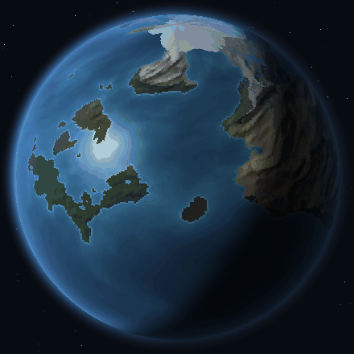
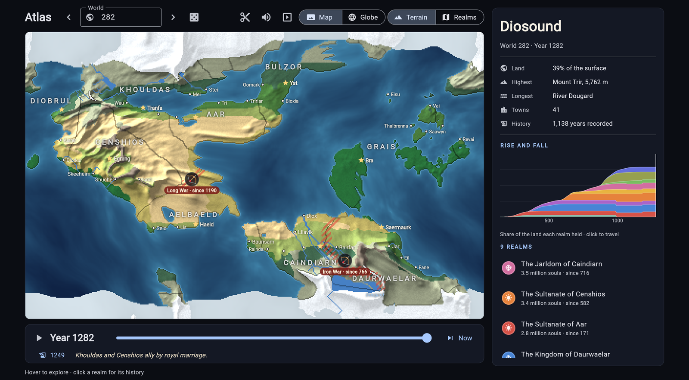
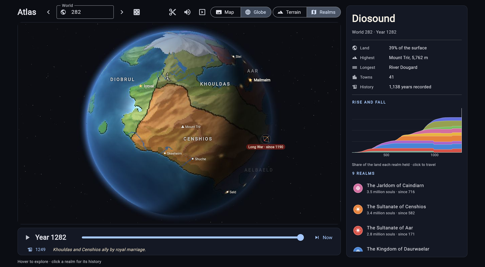
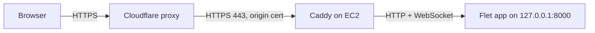

# Atlas of Seeds

[](https://github.com/ToDucThanh/atlas-of-seeds/actions/workflows/ci.yml)

**Type a number or a word, get a world, and scrub through its history on a spinning globe.**

### [▶ Try it at atlasofseeds.com](https://atlasofseeds.com)

<p align="center">
  
</p>

Every seed grows its own planet: terrain, climate, rivers, and a thousand years of realms that rise, fight and fall. Each realm speaks its own made-up language, and each world gets its own soundtrack. Everything is drawn in Python, with no game engine and no image or audio files.



## What you can do

- **Grow a world from any seed.** `282`, `hello` and `atlantis` each always make the same planet: continents, ice caps, biomes, rivers and towns.
- **Scrub through its history.** Drag the timeline and watch realms grow out from their capitals, wars move borders, and a fallen realm reappear in the past. Battles, sacks and usurpers are marked on the map.
- **Read its lore.** Every realm has a name, a dynasty, a government, trade and a faith, all derived from its real geography and neighbours. Names within a realm share its language.
- **Spin the globe.** A lit orthographic globe with a day-night terminator; towns light up on the night side.
- **Watch a replay.** History plays back with a camera that swings to each war, and a soundtrack synthesised for that world, with drums, horns and bells for events. Cinema mode replays one world after another, full screen.
- **Cut a cross-section.** Drag across the map with the scissors and the slice opens as a falling-sand sandbox: sea, rock, sand, soil and forest. Burn it, flood it, then close it, and the changes are written back to the map.



## How it works

Atlas is a [Flet](https://flet.dev) app: the UI is Flutter, but all the logic runs in Python, and on the web every frame is drawn on the server.

- **World generation** (`planet.py`) is layered noise on a map that wraps east to west, then climate, biomes, rivers that follow the terrain downhill, and realms seeded where the land can feed people. It all derives from one `numpy` random generator, so a seed is a world.
- **History** (`history.py`) stores, for every map cell, the year its owner took it and who held it before. That's enough to redraw the political map for any year instantly, without simulating anything while you scrub.
- **The globe** (`globe.py`) precomputes, for each view latitude, which map cell each screen pixel sees and how it's lit. A frame is then one NumPy gather plus a few multiplies.
- **On the web**, the server streams globe frames to the browser as JPEG (about 37 KB each, 15 fps) over Flet's WebSocket, drawn on a worker thread so the UI stays responsive. The globe comes to rest 30 seconds after you let go, so an idle tab costs nothing.
- **Sound** (`sound.py`) is synthesised with NumPy: a seamless drone per seed, with partials that complete whole cycles in the loop, and one-shot cues for history events.
- **The sandbox** (`sand.py`) is a falling-sand simulation vectorised with NumPy row by row, so each particle moves at most once per step.

## Run it locally

You need [uv](https://docs.astral.sh/uv/). It installs Python 3.12 and the pinned dependencies on first run.

```bash
uv run python world.py                     # desktop window, world 282
uv run python world.py atlantis            # any number or word is a seed
uv run python world.py 282 1184 Aar        # world 282 in the year 1184, with the realm Aar selected
uv run python world.py 282 --globe         # open on the spinning globe
uv run python world.py 282 --globe --replay            # replay history, the camera following each war
uv run python world.py 282 --cut=79,123,53,272         # open a cross-section between two map cells
```

To run it as a website on your machine instead, as it runs in production:

```bash
FLET_FORCE_WEB_SERVER=1 FLET_SERVER_PORT=8000 uv run python world.py   # then open http://localhost:8000
```

## Deployment

The live site is one small AWS Graviton server in Singapore, behind Cloudflare. It's reachable only through Cloudflare, and built entirely with Terraform.



- [`infra/`](infra/) is Terraform for the EC2 instance, the security group (HTTPS from Cloudflare's IP ranges only), the Cloudflare DNS and SSL settings, the origin certificate and a cost budget. On first boot, cloud-init installs Caddy, uv and a systemd service.
- [`deploy.sh`](deploy.sh) ships a new version: rsync, `uv sync --locked`, restart.
- [`DEPLOY.md`](DEPLOY.md) is the full guide, including costs (about $21 a month), verification, monitoring and troubleshooting.

## Project map

| File | What it does |
| --- | --- |
| `world.py` | The app: map and globe views, timeline, realm panel, replays, cinema mode, cut mode |
| `planet.py` | Deterministic planet generator and the flat map renderer |
| `lore.py` | Per-realm languages, names, dynasties, governments and events |
| `history.py` | Who ruled which land in any year, and the markers for wars and battles |
| `globe.py` | The lit orthographic globe |
| `section.py` | Cross-sections: a slice of the world as sandbox terrain, and back again |
| `sand.py` | The falling-sand simulation |
| `sandbox_ui.py` | The sandbox screen: materials, brush, play and pause |
| `sound.py` | Synthesised drones and event cues |
| `soundtrack.py` | Plays them in Flet, on the desktop and in the browser |
| `assets/` | The web page Flet serves, with the title and link-preview tags, and the preview image |

## License

[MIT](LICENSE)
